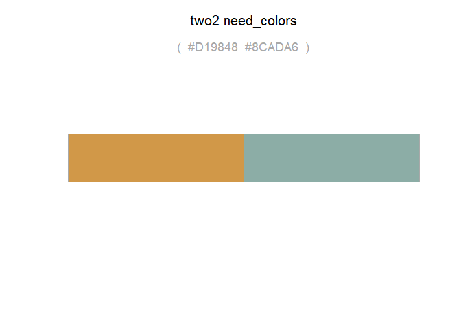
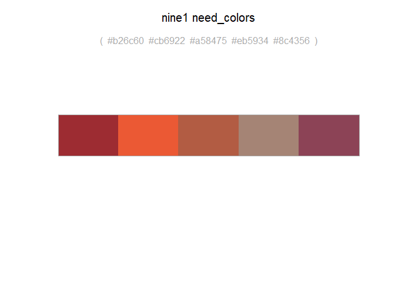
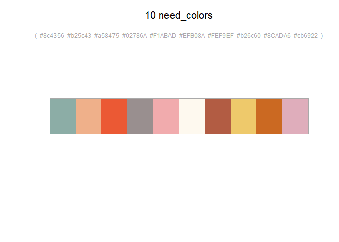
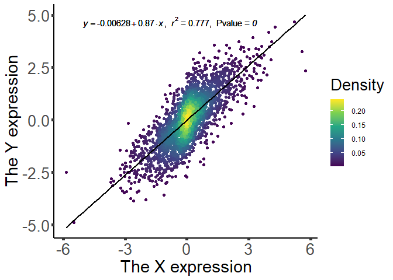
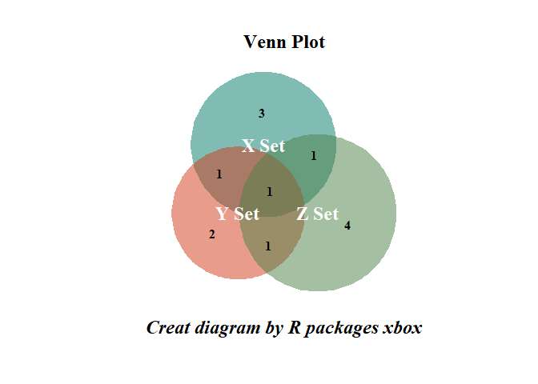
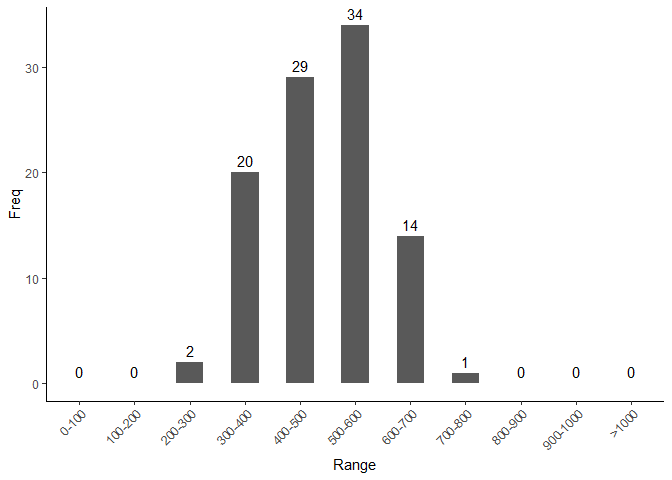

<!-- README.md is generated from README.Rmd. Please edit that file -->
<!-- badges: start -->

[](https://img.shields.io/github/issues/wangjiaxuan666/xbox)
[](https://img.shields.io/github/forks/wangjiaxuan666/xbox)
[](https://img.shields.io/github/stars/wangjiaxuan666/xbox)
<!-- badges: end -->

# xbox:wrench: 

**Author**: [Jiaxuan Wang](https://abego.cn/) :pencil:

[](https://pic-1259340288.cos.ap-guangzhou.myqcloud.com/back/qrcode_for_Wechat.jpg)

The goal of xbox is created with some script writed in my spare time. on
the other side, the R packages is created just for myself. My names is
Wang Jiaxuan, a chinese name. the packages named “xbox” because the tail
name is xuan. like xuan’s tool box(Why not xtoolbox, or xtbox, No! these
are so complex).

with the time flewed, the R packages function will be more and more.

## update log

### update 20201212

-   [x] change the function `get_df` fix the bug for select the column
    names
-   [x] add the function `get_mat` for transfer data.frame or tibble to
    matrix
-   [x] `get_tb` add the `var` for change the “rownames” to “id”

### update 20201227

-   [x] add the fucntion ‘need\_colors’ to choose the chinese
    traditional color palette that disigned by 大东设计. who is a bolger
    in tiktok(抖音). When I saw his painting, I feel shock for those
    color’s power. So I decide make a R packages to put those color into
    a color schemes that everyone can use easily. and you can use
    `disco` to display the color you choose. It is convenient to choose
    the one which you like most.

### update 20210123

-   [x] add the `vennplot` function for draw venn plot, It’s not a
    simple venn plot , it’s a venn plot can change the intersect area
    represent the intersect number size. also somebody call it
    area-proportional Venn diagrams.

## Installation

The R packages only can install the development version from
[GitHub](https://github.com/wangjiaxuan666/xbox) with:

``` r
# install.packages("devtools")
devtools::install_github("wangjiaxuan666/xbox")
```

Notice, If install failed with the messages

    ERROR: dependencies 'KEGGREST', 'qvalue' are not available for package 'xbox'
    * removing 'C:/R/library/xbox'

You should install R packages `KEGGREST` and `qvalue` firstly with code:

``` r
if (!requireNamespace("BiocManager", quietly = TRUE))
    install.packages("BiocManager")

BiocManager::install("qvalue")
BiocManager::install("KEGGREST")
```

# Update

It’s best to update before you start use the package. just because it is
constantly updated and add new fucntion within.

``` r
devtools::update_packages("xbox")
```

## Function

Firstlrmarkdown::render(“README.Rmd”) y, you should library the `xbox` R
packages.

``` r
library(xbox)
```

### need\_colors and disco

add the fucntion ‘need\_colors’ to choose the chinese traditional color
palette that disigned by 大东设计. who is a bolger in tiktok(抖音). When
I saw his painting, I feel shock for those color’s power. So I decide
make a R packages to put those color into a color schemes that everyone
can use easily. and you can use `disco` to display the color you choose.
It is convenient to choose the one which you like most.

``` r
need_colors("two2")
#> [1] "#8CADA6" "#D19848"
disco("two2")
```



``` r
need_colors("nine1",5)
#> [1] "#9d2c32" "#eb5934" "#c32a2c" "#8c4356" "#494367"
disco("nine1",5)
```



In my disign, for ease of use. I use the ‘the number which you want’ +
‘id’ to name the color palette, such as
“two1”,“two2”,“three1”,“four1”,“nine1”. Even you forget so simple name,
it’s doesn’t matter. Beacuse you can use the number directly. Now, in a
word, it’s very convenient!!

``` r
need_colors(10)
#> Randomly select 10 colors from all the colors.
#>  [1] "#494367" "#F1ABAD" "#D19848" "#EFB08A" "#8CADA6" "#F1ABAD"
#>  [7] "#eb5934" "#cb6922" "#8c4356" "#c32a2c"
disco(10)
#> Randomly select 10 colors from all the colors.
```



    #> Randomly select 10 colors from all the colors.
    #> Randomly select 10 colors from all the colors.
    #> Randomly select 10 colors from all the colors.

For more details, please see the bolg
“<a href="https://mp.weixin.qq.com/s?__biz=MzI3NDEwMjgxMA==&mid=2650603537&idx=1&sn=b31e5a5a8a7963230d7e155b9840ed5d&chksm=f3108f64c467067231521c6b4c333224683c9ec2ceafa857c568aa70dcc953069f70b054e748&token=233807204&lang=zh_CN#rd" target="_blank">R包xbox-增加中国风配色方案”</a>,
which publiced on WeChat official
account.<a href="https://pic-1259340288.cos.ap-guangzhou.myqcloud.com/back/qrcode_for_Wechat.jpg" target="_blank">Abego</a>

### col\_ttest

the first function is `col_ttest`, the function is creat for the
`t.test` in the two column group to test. the output including the
**pvalue**,**qvalue**. Notice,the qvalue is the result of the R packages
[`qvalue`](https://www.bioconductor.org/packages/release/bioc/html/qvalue.html).the
parameter is defult. I think is adjust pvalue method is
[bonferroni](https://www.statisticssolutions.com/bonferroni-correction/).

``` r
set.seed("20201225")
test = matrix(rnorm(20), 2, 10)
colnames(test) = paste("Test", 1:10, sep = "")
rownames(test) = paste("Gene", 1:2, sep = "")
str(col_ttest(data = test,g1 = 1:5,g2 = 6:10))
#> The number is less than 5000, and adjust pvalue is not recommended
#> 'data.frame':    2 obs. of  11 variables:
#>  $ Test1 : num  1.342 0.182
#>  $ Test2 : num  0.524 -0.16
#>  $ Test3 : num  0.6 1.27
#>  $ Test4 : num  1.169 -0.359
#>  $ Test5 : num  -1.42 -0.24
#>  $ Test6 : num  1.237 0.145
#>  $ Test7 : num  0.0264 -2.3262
#>  $ Test8 : num  -0.306 0.251
#>  $ Test9 : num  -0.386 -0.864
#>  $ Test10: num  1.079 0.726
#>  $ pv    : num  0.855 0.406
```

### t\_dat

the `t_dat` function is uesed for transpose the data. Notice,it’s not
the function `transpose` in `tidyverse` or `tidyr`. `t_dat` can exchange
the column and row. Make the column names become the row names and the
row names become the column names. the data is tranpose with the names.
it is complex for me to explain it clearly with the English. let’s see
how does it work.

``` r
df = mtcars[1:6,1:6]
print(df)
#>                    mpg cyl disp  hp drat    wt
#> Mazda RX4         21.0   6  160 110 3.90 2.620
#> Mazda RX4 Wag     21.0   6  160 110 3.90 2.875
#> Datsun 710        22.8   4  108  93 3.85 2.320
#> Hornet 4 Drive    21.4   6  258 110 3.08 3.215
#> Hornet Sportabout 18.7   8  360 175 3.15 3.440
#> Valiant           18.1   6  225 105 2.76 3.460
print(t_dat(df))
#> ... Notice: Use`retype` function in `hablar` packages
#>  Should be better to check it again# A tibble: 6 x 6
#>   `Mazda RX4` `Mazda RX4 Wag` `Datsun 710` `Hornet 4 Drive`
#> *       <dbl>           <dbl>        <dbl>            <dbl>
#> 1       21              21           22.8             21.4 
#> 2        6               6            4                6   
#> 3      160             160          108              258   
#> 4      110             110           93              110   
#> 5        3.9             3.9          3.85             3.08
#> 6        2.62            2.88         2.32             3.22
#> # ... with 2 more variables: `Hornet Sportabout` <dbl>,
#> #   Valiant <dbl>
```

Maybe you have see the `NOTICE` that mentioned the R packages `hablar`.
The `hablar` is creat by David Sjoberg. a excellent R packages. You can
see its introdution in [Github](https://github.com/davidsjoberg/hablar).
i use the funtion `retype` to help the change and ensure the column
type. But I still think we should chect the result again by `str()`.

### koid\_to\_pathway

the function is useful the biology. If you have a list of ko number id.
But don’t know the the name or descrption of the ko ID . You should try
the function. I use the `keggget`funtion in R packages `KEEGREST` which
R packages in
[bioconda](https://www.bioconductor.org/packages/release/bioc/html/KEGGREST.html).
the native function can scrawl the all information form KEGG Database.
But I only need the `KEGG A Anoation`,`KEGG B Anoation` and the
`KEGG Pathway Anoation`. So the `koid_to_pathway` only extract the the
information of the pathway description. like thie:

``` r
koid_to_pathway("ko04075")
#>      koid
#> 1 ko04075
#>                                                     kegg_AB
#> 1 Environmental Information Processing; Signal transduction
#>                                desc
#> 1 Plant hormone signal transduction
#Success depends on the network.
#koid <-c("ko00010", "ko00020", "ko00030")
#koid_to_pathway(koid)
```

### get\_tb, get\_df and get\_mat

the simple function! the thing only can be done is change the data.frame
to a tibble. I creat it just because of the funtion `rownams_to_column`
which’s names is too long!

The simple example is :

``` r
head(cars)
#>   speed dist
#> 1     4    2
#> 2     4   10
#> 3     7    4
#> 4     7   22
#> 5     8   16
#> 6     9   10
head(get_tb(cars))
#> ...Finished:the input data is a data frame not a tibble
#> # A tibble: 6 x 3
#>   id    speed  dist
#>   <chr> <dbl> <dbl>
#> 1 1         4     2
#> 2 2         4    10
#> 3 3         7     4
#> 4 4         7    22
#> 5 5         8    16
#> 6 6         9    10
```

Not end the sister function `get_df`, Which change the tibble to
data.frame .

``` r
head(mtcars)
#>                    mpg cyl disp  hp drat    wt  qsec vs am gear
#> Mazda RX4         21.0   6  160 110 3.90 2.620 16.46  0  1    4
#> Mazda RX4 Wag     21.0   6  160 110 3.90 2.875 17.02  0  1    4
#> Datsun 710        22.8   4  108  93 3.85 2.320 18.61  1  1    4
#> Hornet 4 Drive    21.4   6  258 110 3.08 3.215 19.44  1  0    3
#> Hornet Sportabout 18.7   8  360 175 3.15 3.440 17.02  0  0    3
#> Valiant           18.1   6  225 105 2.76 3.460 20.22  1  0    3
#>                   carb
#> Mazda RX4            4
#> Mazda RX4 Wag        4
#> Datsun 710           1
#> Hornet 4 Drive       1
#> Hornet Sportabout    2
#> Valiant              1
head(get_df(mtcars))
#> ...Finished:the input data is a data.frame
#> have no change
#>                    mpg cyl disp  hp drat    wt  qsec vs am gear
#> Mazda RX4         21.0   6  160 110 3.90 2.620 16.46  0  1    4
#> Mazda RX4 Wag     21.0   6  160 110 3.90 2.875 17.02  0  1    4
#> Datsun 710        22.8   4  108  93 3.85 2.320 18.61  1  1    4
#> Hornet 4 Drive    21.4   6  258 110 3.08 3.215 19.44  1  0    3
#> Hornet Sportabout 18.7   8  360 175 3.15 3.440 17.02  0  0    3
#> Valiant           18.1   6  225 105 2.76 3.460 20.22  1  0    3
#>                   carb
#> Mazda RX4            4
#> Mazda RX4 Wag        4
#> Datsun 710           1
#> Hornet 4 Drive       1
#> Hornet Sportabout    2
#> Valiant              1
```

The `get_mat` function is used for tansfer data whatever which type it
is to a matrix.

``` r
head(get_mat(cars))
#>   speed dist
#> 1     4    2
#> 2     4   10
#> 3     7    4
#> 4     7   22
#> 5     8   16
#> 6     9   10
```

### the heat density point plot

The function `heatpoint` is created for the desity plot, It can caculate
the point density in 2-dimension coordinate or 1D coordinate by the
parameter `only`. Of course, the Main purpose is the plot a density
heatpoint.

``` r
points = 5000
x = c(rnorm(points/2))
y = x + rnorm(points/2,sd=0.8)
x = sign(x)*abs(x)^1.3
heatpoint(x,y) -> dat_result
str(dat_result)
#> List of 3
#>  $ plot.data :'data.frame':  2500 obs. of  3 variables:
#>   ..$ x      : num [1:2500] -0.25 -1.664 -0.192 -0.124 2.003 ...
#>   ..$ y      : num [1:2500] -0.7618 -0.906 0.0769 0.5704 1.5979 ...
#>   ..$ Density: num [1:2500] 0.1649 0.0324 0.1933 0.1825 0.0314 ...
#>  $ cor.result:List of 3
#>   ..$ cor   : num 0.777
#>   ..$ pvalue: num 0
#>   ..$ method:List of 1
#>   .. ..$ method: chr "Pearson's product-moment correlation"
#>  $ lm.result :List of 3
#>   ..$ formula: Named num [1:2] -0.00628 0.87033
#>   .. ..- attr(*, "names")= chr [1:2] "(Intercept)" "x"
#>   ..$ method : symbol lm
#>   ..$ exp    :Class 'formula'  language y ~ x
#>   .. .. ..- attr(*, ".Environment")=<environment: 0x0000019ed274a390> 
#>  - attr(*, "class")= chr "heatpoint"
#including the three list the plot data
head(dat_result$plot.data)
#>            x           y    Density
#> 1 -0.2496371 -0.76182440 0.16489377
#> 2 -1.6637152 -0.90595769 0.03244137
#> 3 -0.1917298  0.07688888 0.19327535
#> 4 -0.1238316  0.57038733 0.18248076
#> 5  2.0029295  1.59785190 0.03138423
#> 6  0.3509336 -0.74778409 0.08520389
# and the result of cor
data.frame(dat_result$cor.result)
#>         cor pvalue                               method
#> 1 0.7765534      0 Pearson's product-moment correlation
# and the result of lm
str(dat_result$lm.result)
#> List of 3
#>  $ formula: Named num [1:2] -0.00628 0.87033
#>   ..- attr(*, "names")= chr [1:2] "(Intercept)" "x"
#>  $ method : symbol lm
#>  $ exp    :Class 'formula'  language y ~ x
#>   .. ..- attr(*, ".Environment")=<environment: 0x0000019ed274a390>
```

You can use the result of `heatpoint`to plot by yourself, also can use
the the R scription in R packages names`plot`

``` r
xplot(dat_result)
#> Warning in is.na(x): is.na()不适用于类别为'language'的非串列或非
#> 矢量
```



### vennplot

Draw an area-proportional Venn diagram of 2 or 3 circles change by
wangjiaxuan The original function from bioVenn R
packages(<https://cran.r-project.org/web/packages/BioVenn/index.html>),
I improve the data output and delete the `output` parameter. on the next
step , I plan to add the ggplot2 on the function which draw venn plot.
or change the postion of group title name whcih is on the centre of
circle now, very ugly.

This function creates an area-proportional Venn diagram of 2 or 3
circles, based on lists of (biological) identifiers. It requires three
parameters: input lists X, Y and Z. For a 2-circle Venn diagram, one of
these lists should be left empty. Duplicate identifiers are removed
automatically.

When using a BioVenn diagram for a publication, please cite: BioVenn - a
web application for the comparison and visualization of biological lists
using area-proportional Venn diagrams T. Hulsen, J. de Vlieg and W.
Alkema, BMC Genomics 2008, 9 (1): 488

``` r
list_x <- c("1007_s_at","1053_at","117_at","121_at","1255_g_at","1294_at")
list_y <- c("1255_g_at","1294_at","1316_at","1320_at","1405_i_at")
list_z <- c("1007_s_at","1405_i_at","1255_g_at","1431_at","1438_at","1487_at","1494_f_at")
biovenn <- vennplot(list_x, list_y, list_z)
#> ----------------------------------------------------------------- 
#> Venn Data: 
#>  x.total y.total z.total x.only y_only z_only xuy xuz yuz xny
#>        6       5       7      3      2      4   2   2   2   1
#>  xnz ynz xnynz xuyuz
#>    1   1     1     3
#> -----------------------------------------------------------------
```


\#\# count\_range

This function is to be able to calculate counts in various ranges. It
comes with a drawing function. At present, this function is s3 general
function, which can automatically identify the input data type and draw.

``` r
data = range_count(x = rnorm(100,5)*100,gap = 100,min_num = 0,max_num = 1000)
print(data)
#>       Range Freq
#> 1     0-100    0
#> 2   100-200    0
#> 3   200-300    2
#> 4   300-400   20
#> 5   400-500   29
#> 6   500-600   34
#> 7   600-700   14
#> 8   700-800    1
#> 9   800-900    0
#> 10 900-1000    0
#> 11    >1000    0
xplot(data)
```



## END

``` r
devtools::session_info()[["platform"]]
#>  setting  value                         
#>  version  R version 4.0.3 (2020-10-10)  
#>  os       Windows 10 x64                
#>  system   x86_64, mingw32               
#>  ui       RStudio                       
#>  language (EN)                          
#>  collate  Chinese (Simplified)_China.936
#>  ctype    Chinese (Simplified)_China.936
#>  tz       Asia/Taipei                   
#>  date     2021-03-12
```

``` r
Sys.Date()
#> [1] "2021-03-12"
```
